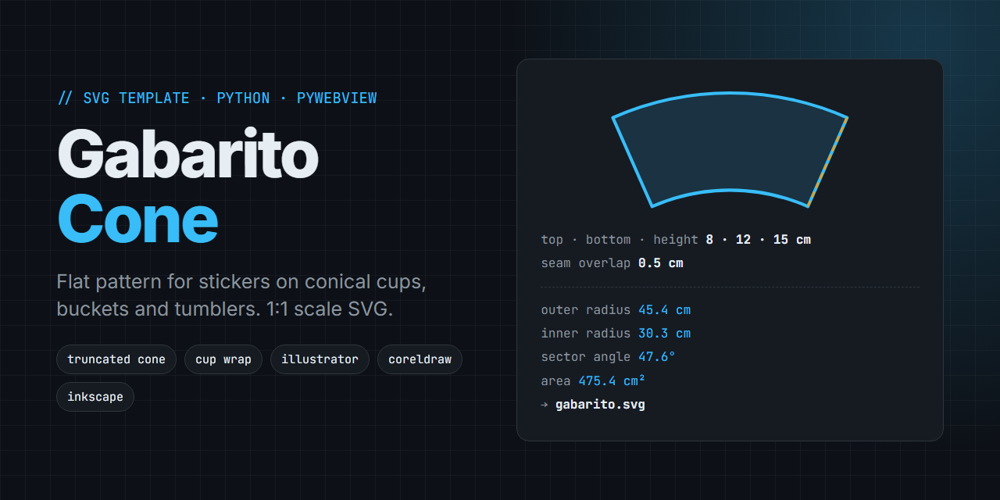

# Gabarito Cone: truncated cone template generator (SVG) for cup, bucket and tumbler stickers



**Gabarito Cone** is a small desktop tool for graphic designers that generates the flat pattern (development) of a truncated cone as a 1:1 scale SVG, so you can wrap a label or sticker around a conical cup, popcorn bucket or tapered mug without crooked seams; it is written in Python with a pywebview window.

You enter the top diameter, bottom diameter and height in centimeters. The tool draws the annular sector (the curved label shape), adds an optional seam overlap, and saves `gabarito.svg` ready to open in Illustrator, CorelDRAW, Inkscape, Affinity Designer or Figma.

> Truncated cone template · cone flat pattern · conical label template · cup wrap template · popcorn bucket template · sublimation tumbler template · SVG clipping mask · gabarito de copo

## Features

- **1:1 scale vector output.** The SVG is sized in millimeters, so it imports at real size with no resizing.
- **Exact curvature.** The arc of the label is calculated from the cone geometry, not estimated.
- **Seam overlap (margem de emenda).** Add an overlap in cm for gluing. It is drawn as a dashed orange line.
- **Measurements panel.** Outer radius, inner radius, sector angle, width, height and area (cm²), useful to quote vinyl, adhesive paper or sublimation paper.
- **Cylinder support.** If top and bottom diameters are equal, it outputs a plain rectangle with the circumference.
- **Either orientation.** Works for cups that are wider at the top or at the bottom; the larger diameter always maps to the outer arc.
- No account, no watermark. The math runs locally in Python.

## Use cases

| Product | Application |
|---|---|
| Conical paper or plastic cup, long drink glass | Wrap-around label, promotional sticker |
| Popcorn bucket, ice bucket | Cinema, party and giveaway artwork |
| Conical mug or tumbler for sublimation | 360° print without distortion |
| Vase, planter cover, conical packaging | Brand label, gift kit |
| Client mockups | Precise geometric base for the final artwork |

## Install

Requires Python 3 and [pywebview](https://pywebview.flowrl.com/).

```bash
pip install pywebview
python gabarito_cone.py
```

The window styles itself with Tailwind CSS loaded from a CDN, so the first launch looks best with an internet connection.

## Usage in your design software

1. Run the tool and enter the **top diameter**, **bottom diameter** and **height** in cm (plus the seam overlap if you want one).
2. Click **Gerar Gabarito** (generate), then **Salvar SVG** (save). The file is written to `gabarito.svg` on your Desktop.
3. Import the SVG into Illustrator, CorelDRAW or Inkscape.
4. Use the blue path as a **clipping mask** (PowerClip in CorelDRAW) over your artwork.
5. The dashed orange line marks the **seam**. Keep logos and text away from it.
6. Export to PDF/X, or send the SVG to a cutting plotter.

> Tip: for continuous wrap-around artwork, bend the layout with *Envelope* or *Arc* following the angle shown on the template.

## How the template is calculated

For bottom diameter `D`, top diameter `d` and height `h`:

- Full cone height: `H = h · D / (D − d)`
- Outer radius of the template (larger slant height): `S₁ = √((D/2)² + H²)`
- Inner radius (smaller slant height): `S₂ = √((d/2)² + (H − h)²)`
- Sector angle: `θ = 360° · D / (2·S₁)`

If top equals bottom, the shape is a rectangle (cylinder) with width `π · d`.

## Project structure

```
gabarito_cone.py   # everything: embedded HTML UI, geometry, SVG generation, save to Desktop
```

## FAQ

**Which measurement should I use, inner or outer diameter?**
Use the **outer diameter** of the product, where the sticker will be applied.

**Does the SVG open in Photoshop?**
It opens as a smart object. For vector clipping, Illustrator or CorelDRAW work better.

**What if my cup is wider at the bottom than at the top?**
That works too. The tool always puts the larger diameter on the outer arc and labels each edge TOPO (top) or BASE (bottom).

**Where is the file saved?**
`gabarito.svg` in your Desktop folder. Saving again overwrites it.
